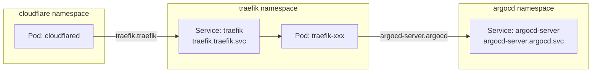

# Kubernetes DNS & Service Discovery

This document explains how Kubernetes DNS works and why you see names like `traefik.traefik`.

## The traefik.traefik Mystery

When you see a service address like `traefik.traefik.svc.cluster.local`, it's not a typo! Here's what each part means:

```
traefik.traefik.svc.cluster.local
   │       │     │      │
   │       │     │      └── Cluster domain suffix (default)
   │       │     └── "svc" indicates this is a Service
   │       └── Namespace name: "traefik"
   └── Service name: "traefik"
```

## Why the Same Name Twice?

It's a common Kubernetes convention to:

1. **Create a namespace** with the application name (e.g., `traefik`)
2. **Create a service** with the same name inside that namespace (e.g., `traefik`)

This results in `traefik.traefik` - the service named "traefik" in the namespace "traefik".

### Other Examples

| Service | Full DNS Name | Explanation |
|---------|---------------|-------------|
| `traefik.traefik` | `traefik.traefik.svc.cluster.local` | Traefik service in traefik namespace |
| `argocd-server.argocd` | `argocd-server.argocd.svc.cluster.local` | ArgoCD server in argocd namespace |
| `cloudflared.cloudflare` | `cloudflared.cloudflare.svc.cluster.local` | Cloudflared in cloudflare namespace |

## DNS Resolution Rules

Kubernetes DNS resolves service names based on where the request originates:

### From the Same Namespace

```yaml
# If you're in the "traefik" namespace, you can use:
url: http://traefik           # Just the service name
url: http://traefik.traefik   # service.namespace (explicit)
```

### From a Different Namespace

```yaml
# If you're in the "argocd" namespace, you must specify:
url: http://traefik.traefik   # service.namespace (minimum required)
url: http://traefik.traefik.svc.cluster.local  # Full FQDN
```

## Practical Example: Cloudflare Tunnel

When configuring Cloudflare Tunnel to route traffic to Traefik:

```yaml
# Cloudflare Tunnel configuration
ingress:
  - hostname: dev.holm.chat
    service: http://traefik.traefik.svc.cluster.local:80
    #              └─────────────────────────────────┘
    #              Full address to Traefik service
```

The tunnel (running in `cloudflare` namespace) needs to reach Traefik (in `traefik` namespace), so we use the full service address.

## DNS Diagram



## Best Practices

1. **Always use explicit namespace** when referencing services across namespaces
2. **Use short names** only within the same namespace
3. **Document service addresses** in your configuration for clarity
4. **Consider using the full FQDN** in production configs for clarity
