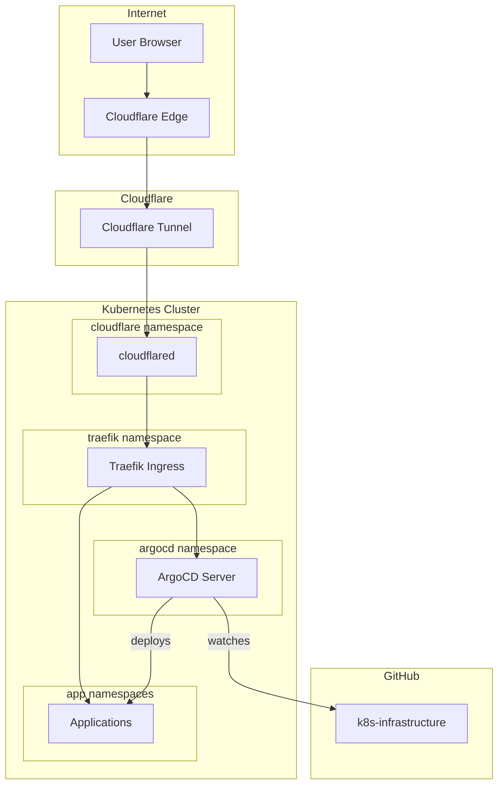

# Architecture Overview

This document explains the overall architecture of the k8s-infrastructure GitOps setup.

## High-Level Architecture

## Traffic Flow

1. **User** makes a request to `dev.holm.chat`
2. **Cloudflare** routes the request through the Tunnel
3. **cloudflared** (running in-cluster) receives the request
4. **Traefik** handles routing based on host/path
5. **Application** (ArgoCD, etc.) receives the request

## GitOps Flow

1. Developer pushes changes to GitHub
2. ArgoCD detects the change (via polling or webhook)
3. ArgoCD compares desired state (Git) vs actual state (cluster)
4. ArgoCD applies the difference to the cluster
5. Resources are created/updated/deleted automatically

## Component Responsibilities

| Component | Responsibility |
|-----------|---------------|
| **Cloudflare Tunnel** | Secure ingress without exposing cluster IPs |
| **Traefik** | Route traffic to services, handle TLS, path-based routing |
| **ArgoCD** | Sync Git state to cluster, manage deployments |
| **Kustomize** | Environment-specific configuration overlays |
