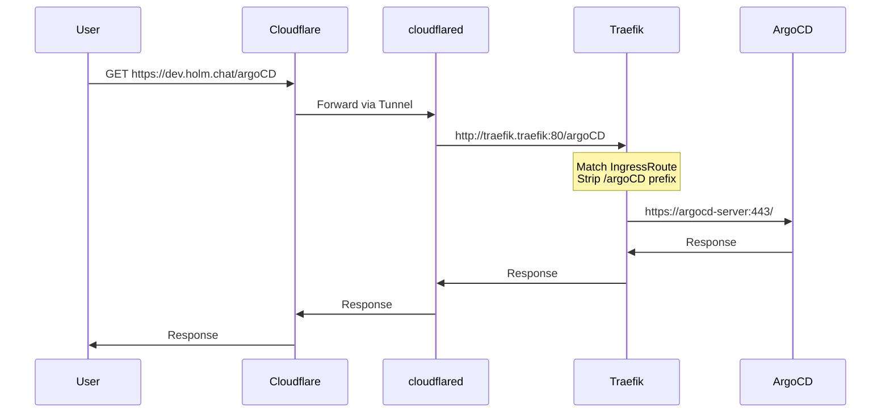
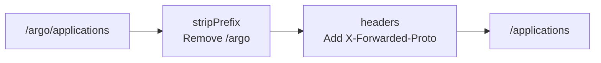
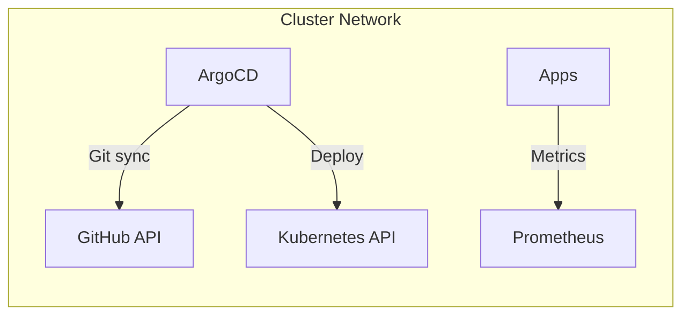

# Traffic Flow

This document details how traffic flows from the internet to your applications.

## External Access via Cloudflare Tunnel



## Why This Architecture?

### No Public IPs Required

Traditional Kubernetes ingress requires:
- A LoadBalancer service (costs money)
- Public IP addresses
- Firewall configuration
- DDoS protection

With Cloudflare Tunnel:
- **Zero public IPs** - Tunnel creates outbound connection
- **Free DDoS protection** - Cloudflare handles it
- **Built-in TLS** - Cloudflare manages certificates
- **Zero attack surface** - No inbound ports open

### Path-Based Routing

Multiple services share one domain:

| URL | Service |
|-----|---------|
| `dev.holm.chat/argoCD` | ArgoCD |
| `dev.holm.chat/traefik` | Traefik Dashboard |
| `dev.holm.chat/` | Default application |

## Traefik IngressRoute

Traefik uses `IngressRoute` CRDs for advanced routing:

```yaml
apiVersion: traefik.io/v1alpha1
kind: IngressRoute
metadata:
  name: argocd-server
  namespace: argocd
spec:
  entryPoints:
    - websecure
  routes:
    - match: Host(`dev.holm.chat`) && PathPrefix(`/argo`)
      kind: Rule
      services:
        - name: argocd-server
          port: 443
      middlewares:
        - name: argocd-stripprefix  # Remove /argo before forwarding
```

### Middleware Chain



## Internal Traffic

Services communicate directly within the cluster:



Internal traffic bypasses Traefik and Cloudflare entirely.
