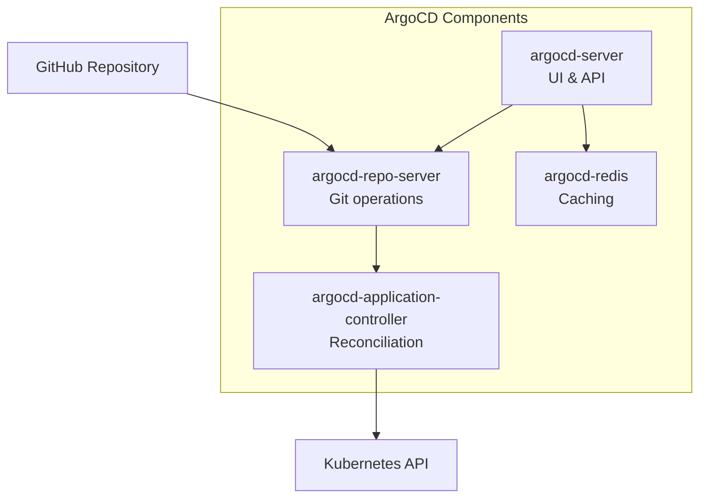

# ArgoCD

ArgoCD is the GitOps continuous delivery tool that keeps the cluster in sync with this Git repository.

## Overview

| Property | Value |
|----------|-------|
| Namespace | `argocd` |
| URL | [dev.holm.chat/argo](https://dev.holm.chat/argo) |
| Version | v2.9.3 |

## Architecture



## App-of-Apps Pattern

We use the "app-of-apps" pattern where a single ArgoCD Application manages all other Applications:

```
app-of-apps (argocd/bootstrap/app-of-apps.yaml)
    │
    ├── dev-infrastructure
    ├── staging-infrastructure
    └── prod-infrastructure
```

This allows:
- **Single bootstrap command** - Deploy everything with one `kubectl apply`
- **Self-managing** - ArgoCD manages itself
- **Declarative** - All Applications defined in Git

## Configuration

### Base URL (Path-Based Routing)

ArgoCD is configured to run at `/argo`:

```yaml
# argocd/bootstrap/install.yaml
apiVersion: v1
kind: ConfigMap
metadata:
  name: argocd-cm
data:
  url: https://dev.holm.chat/argo
  server.rootpath: /argo
```

### RBAC

Role-based access control is configured in `argocd-rbac-cm`:

```yaml
policy.csv: |
  g, admin, role:admin
  p, role:developer, applications, get, */*, allow
  p, role:developer, applications, sync, */*, allow
```

## Sync Policies

| Environment | Auto Sync | Self Heal | Prune |
|-------------|-----------|-----------|-------|
| dev | ✅ | ✅ | ✅ |
| staging | ✅ | ✅ | ✅ |
| prod | ❌ | ❌ | ❌ |

!!! warning "Production"
    Production requires **manual sync** to prevent accidental deployments.

## Common Operations

### Get Admin Password

```bash
kubectl -n argocd get secret argocd-initial-admin-secret \
  -o jsonpath="{.data.password}" | base64 -d
```

### Force Sync

```bash
argocd app sync <app-name>
```

### Check Application Status

```bash
argocd app get <app-name>
```

## Files

| File | Purpose |
|------|---------|
| `argocd/bootstrap/install.yaml` | ConfigMaps and custom settings |
| `argocd/bootstrap/app-of-apps.yaml` | Root Application |
| `argocd/bootstrap/ingress/` | Traefik IngressRoute |
| `argocd/projects/` | ArgoCD Applications per environment |
