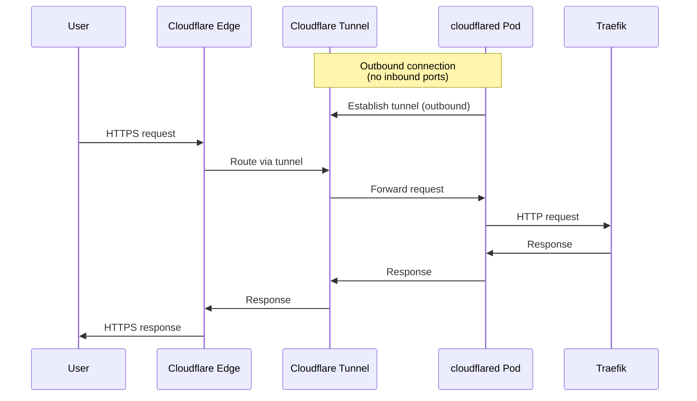

# Cloudflare Tunnel

Cloudflare Tunnel provides secure external access to the cluster without exposing any public IPs.

## Overview

| Property | Value |
|----------|-------|
| Namespace | `cloudflare` |
| Service | `cloudflared` |
| Replicas | 2 (HA) |

## How It Works



## Security Benefits

| Traditional Ingress | Cloudflare Tunnel |
|---------------------|-------------------|
| Public IP required | No public IPs |
| Open firewall ports | No inbound ports |
| Self-managed TLS | Cloudflare TLS |
| Self-managed DDoS | Cloudflare DDoS protection |
| Attack surface exposed | Zero attack surface |

## Setup

### 1. Create Tunnel in Cloudflare Dashboard

1. Go to [Cloudflare Zero Trust](https://one.dash.cloudflare.com/)
2. Navigate to **Access** → **Tunnels**
3. Click **Create a tunnel**
4. Name it (e.g., `k8s-dev`)
5. Copy the tunnel token

### 2. Create Kubernetes Secret

```bash
kubectl create namespace cloudflare

kubectl create secret generic cloudflare-tunnel-token \
  --from-literal=token=<your-tunnel-token> \
  -n cloudflare
```

!!! danger "Never commit tokens"
    The tunnel token should **never** be committed to Git. Always create it manually or use a secrets manager.

### 3. Configure Tunnel Routes

In Cloudflare Dashboard, add public hostname:

| Hostname | Path | Service |
|----------|------|---------|
| `dev.holm.chat` | `/*` | `http://traefik.traefik.svc.cluster.local:80` |
| `docs.holm.chat` | `/*` | `http://traefik.traefik.svc.cluster.local:80` |

## Configuration

### Deployment

```yaml
apiVersion: apps/v1
kind: Deployment
metadata:
  name: cloudflared
  namespace: cloudflare
spec:
  replicas: 2  # HA - multiple replicas
  template:
    spec:
      containers:
        - name: cloudflared
          image: cloudflare/cloudflared:latest
          args:
            - tunnel
            - --no-autoupdate
            - run
            - --token
            - $(TUNNEL_TOKEN)
          env:
            - name: TUNNEL_TOKEN
              valueFrom:
                secretKeyRef:
                  name: cloudflare-tunnel-token
                  key: token
```

### Health Checks

cloudflared exposes a health endpoint:

```yaml
livenessProbe:
  httpGet:
    path: /ready
    port: 2000
```

## Routing to Services

The tunnel routes traffic to `traefik.traefik.svc.cluster.local`:

```
cloudflared → traefik.traefik:80 → IngressRoutes → Services
```

Traefik then handles path-based routing to individual services.

## Troubleshooting

### Check Tunnel Status

```bash
# Pod logs
kubectl logs -n cloudflare -l app=cloudflared

# Check connection to Cloudflare
kubectl exec -n cloudflare deploy/cloudflared -- \
  cloudflared tunnel info
```

### Common Issues

| Issue | Cause | Solution |
|-------|-------|----------|
| Tunnel disconnects | Token expired | Regenerate token in dashboard |
| 502 Bad Gateway | Traefik not running | Check traefik namespace |
| 404 Not Found | No matching IngressRoute | Check Traefik routes |

## Files

| File | Purpose |
|------|---------|
| `base/infrastructure/cloudflare-tunnel/deployment.yaml` | Cloudflared deployment |
| `base/infrastructure/cloudflare-tunnel/kustomization.yaml` | Kustomize config |
