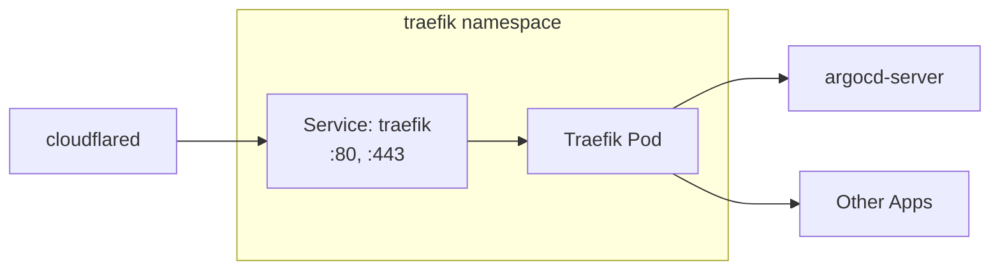

# Traefik

Traefik is the ingress controller that routes external traffic to services within the cluster.

## Overview

| Property | Value |
|----------|-------|
| Namespace | `traefik` |
| Version | v3.0 |
| Service | `traefik.traefik.svc.cluster.local` |
| NodePort | `30190` (local access) |

## Why Traefik?

- **Native Kubernetes support** - Reads Ingress and CRDs automatically
- **Dynamic configuration** - No restarts needed for config changes
- **IngressRoute CRDs** - More powerful than standard Ingress
- **Middleware support** - Path stripping, headers, rate limiting
- **Dashboard** - Built-in monitoring UI

## Architecture



## Service Naming

The service is accessible at `traefik.traefik`:

```
traefik.traefik.svc.cluster.local
   │       │
   │       └── Namespace: traefik
   └── Service name: traefik
```

See [Kubernetes DNS](../architecture/kubernetes-dns.md) for a full explanation.

## IngressRoute vs Ingress

### Standard Kubernetes Ingress

```yaml
apiVersion: networking.k8s.io/v1
kind: Ingress
metadata:
  name: example
spec:
  rules:
    - host: example.com
      http:
        paths:
          - path: /
            backend:
              service:
                name: my-service
                port: 80
```

### Traefik IngressRoute (More Powerful)

```yaml
apiVersion: traefik.io/v1alpha1
kind: IngressRoute
metadata:
  name: example
spec:
  entryPoints:
    - websecure
  routes:
    - match: Host(`example.com`) && PathPrefix(`/api`)
      kind: Rule
      services:
        - name: my-service
          port: 80
      middlewares:
        - name: strip-prefix
        - name: rate-limit
```

IngressRoute advantages:
- Complex matching rules (AND, OR, regex)
- Middleware chains
- Weighted load balancing
- TCP/UDP routing

## Middlewares

### Strip Prefix

Removes path prefix before forwarding:

```yaml
apiVersion: traefik.io/v1alpha1
kind: Middleware
metadata:
  name: strip-argocd
spec:
  stripPrefix:
    prefixes:
      - /argoCD
```

`/argoCD/applications` → `/applications`

### Headers

Adds or modifies headers:

```yaml
apiVersion: traefik.io/v1alpha1
kind: Middleware
metadata:
  name: secure-headers
spec:
  headers:
    customRequestHeaders:
      X-Forwarded-Proto: https
```

## Configuration

### Entrypoints

| Name | Port | Purpose |
|------|------|---------|
| `web` | 80 | HTTP (redirects to HTTPS) |
| `websecure` | 443 | HTTPS |
| `traefik` | 8080 | Dashboard (internal) |

### Command Line Args

```yaml
args:
  - --entrypoints.web.address=:80
  - --entrypoints.websecure.address=:443
  - --entrypoints.web.http.redirections.entrypoint.to=websecure
  - --providers.kubernetescrd
  - --providers.kubernetescrd.allowCrossNamespace=true
```

## Local Access

Traefik exposes NodePort 30190 for local network access without Cloudflare:

```
http://192.168.8.197:30190/[path]
```

Local access URLs:

| Service | URL |
|---------|-----|
| ArgoCD | `http://192.168.8.197:30190/argoCD` |
| Traefik Dashboard | `http://192.168.8.197:30190/traefik` |
| Argo Workflows | `http://192.168.8.197:30190/argo-workflows` |
| Velero/Backup | `http://192.168.8.197:30190/backup` |

## Files

| File | Purpose |
|------|---------|
| `base/infrastructure/traefik/deployment.yaml` | Traefik deployment |
| `base/infrastructure/traefik/service.yaml` | ClusterIP services |
| `base/infrastructure/traefik/rbac.yaml` | ServiceAccount and RBAC |
| `argocd/bootstrap/ingress/` | ArgoCD IngressRoute |
