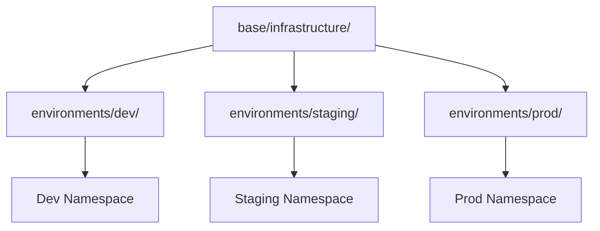

# Environments Overview

This repository manages three environments using Kustomize overlays.

## Environment Comparison

| Property | Dev | Staging | Prod |
|----------|-----|---------|------|
| Namespace | `dev` | `staging` | `prod` |
| Auto Sync | ✅ | ✅ | ❌ |
| Self Heal | ✅ | ✅ | ❌ |
| CPU Requests | 2 cores | 4 cores | 16 cores |
| Memory Requests | 4Gi | 8Gi | 32Gi |
| Pod Limit | 25 | 40 | 100 |

## Directory Structure

```
environments/
├── dev/
│   ├── infrastructure/
│   │   └── kustomization.yaml    # Dev-specific patches
│   └── apps/
├── staging/
│   ├── infrastructure/
│   │   └── kustomization.yaml    # Staging-specific patches
│   └── apps/
└── prod/
    ├── infrastructure/
    │   └── kustomization.yaml    # Prod-specific patches
    └── apps/
```

## How Kustomize Overlays Work



Each environment:
1. References the `base/` manifests
2. Applies environment-specific patches
3. Sets the target namespace
4. Adds environment labels

## Promotion Flow


1. **Dev**: Automatic deployment on every commit
2. **Staging**: Automatic deployment, used for integration testing
3. **Prod**: Manual sync required, change control process

## ArgoCD Applications

Each environment has its own ArgoCD Application:

| Application | Path | Sync Policy |
|-------------|------|-------------|
| `dev-infrastructure` | `environments/dev/infrastructure` | Automated |
| `staging-infrastructure` | `environments/staging/infrastructure` | Automated |
| `prod-infrastructure` | `environments/prod/infrastructure` | Manual |
