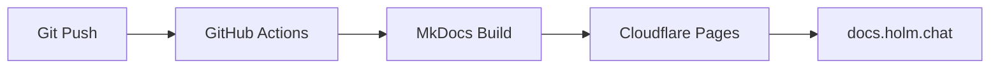

# Documentation Site

This documentation is automatically deployed to [docs.holm.chat](https://docs.holm.chat) via Cloudflare Pages.

## How It Works



1. Push changes to `docs/` or `mkdocs.yml`
2. GitHub Actions triggers automatically
3. MkDocs builds static HTML
4. Cloudflare Pages deploys the site

## Setup Cloudflare Pages

### 1. Create Cloudflare Pages Project

1. Go to [Cloudflare Dashboard](https://dash.cloudflare.com/)
2. Navigate to **Workers & Pages** → **Pages**
3. Click **Create a project** → **Direct Upload** (we'll use GitHub Actions)
4. Name the project: `k8s-docs`

### 2. Create API Token

1. Go to **My Profile** → **API Tokens**
2. Click **Create Token**
3. Use template: **Edit Cloudflare Workers**
4. Or create custom with permissions:
   - Account: Cloudflare Pages: Edit
   - Zone: (optional, for custom domain)
5. Copy the token

### 3. Add GitHub Secrets

In your GitHub repository settings, add:

| Secret | Value |
|--------|-------|
| `CLOUDFLARE_API_TOKEN` | Your API token |
| `CLOUDFLARE_ACCOUNT_ID` | Your account ID (from dashboard URL) |

### 4. Configure Custom Domain

1. In Cloudflare Pages project settings
2. Go to **Custom domains**
3. Add `docs.holm.chat`
4. Cloudflare will automatically configure DNS

## Local Development

### Preview Documentation

```bash
# Install dependencies
pip install mkdocs-material pymdown-extensions

# Serve locally with hot reload
mkdocs serve

# Open http://127.0.0.1:8000
```

### Build Documentation

```bash
mkdocs build

# Output is in site/ directory
```

## Writing Documentation

### File Structure

```
docs/
├── index.md                 # Home page
├── architecture/            # Architecture docs
├── components/              # Component docs
├── environments/            # Environment docs
└── operations/              # Operational guides
```

### Adding a New Page

1. Create the markdown file in `docs/`
2. Add it to `mkdocs.yml` navigation:

```yaml
nav:
  - Home: index.md
  - New Section:
      - My Page: section/my-page.md
```

### Markdown Features

This site uses [Material for MkDocs](https://squidfunk.github.io/mkdocs-material/) with these extensions:

**Admonitions:**
```markdown
!!! note "Title"
    Content here

!!! warning
    Warning content

!!! danger
    Critical warning
```

**Code Blocks:**
```markdown
    ```yaml title="example.yaml" hl_lines="2 3"
    key: value
    highlighted: true
    also: highlighted
    ```
```

**Mermaid Diagrams:**
```markdown
    ```mermaid
    graph LR
        A --> B --> C
    ```
```

**Tabs:**
```markdown
=== "Tab 1"
    Content for tab 1

=== "Tab 2"
    Content for tab 2
```
